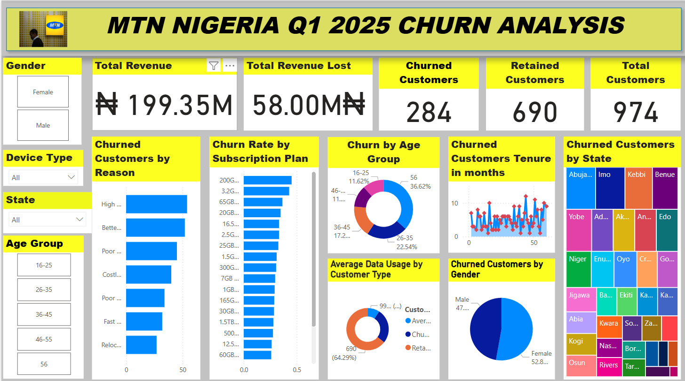
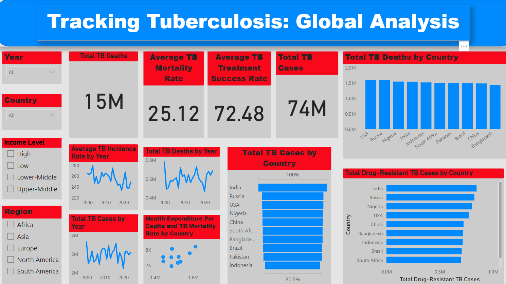
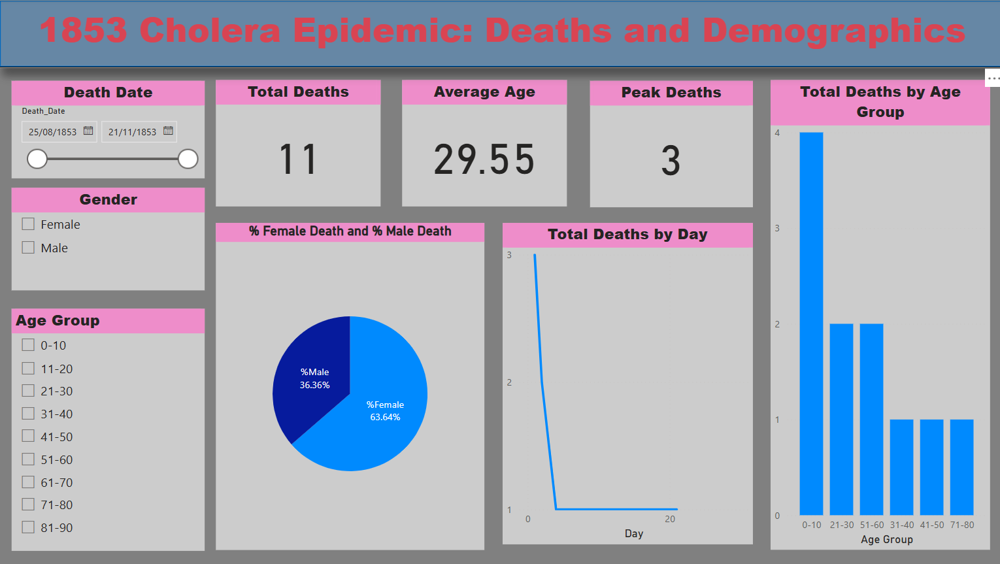
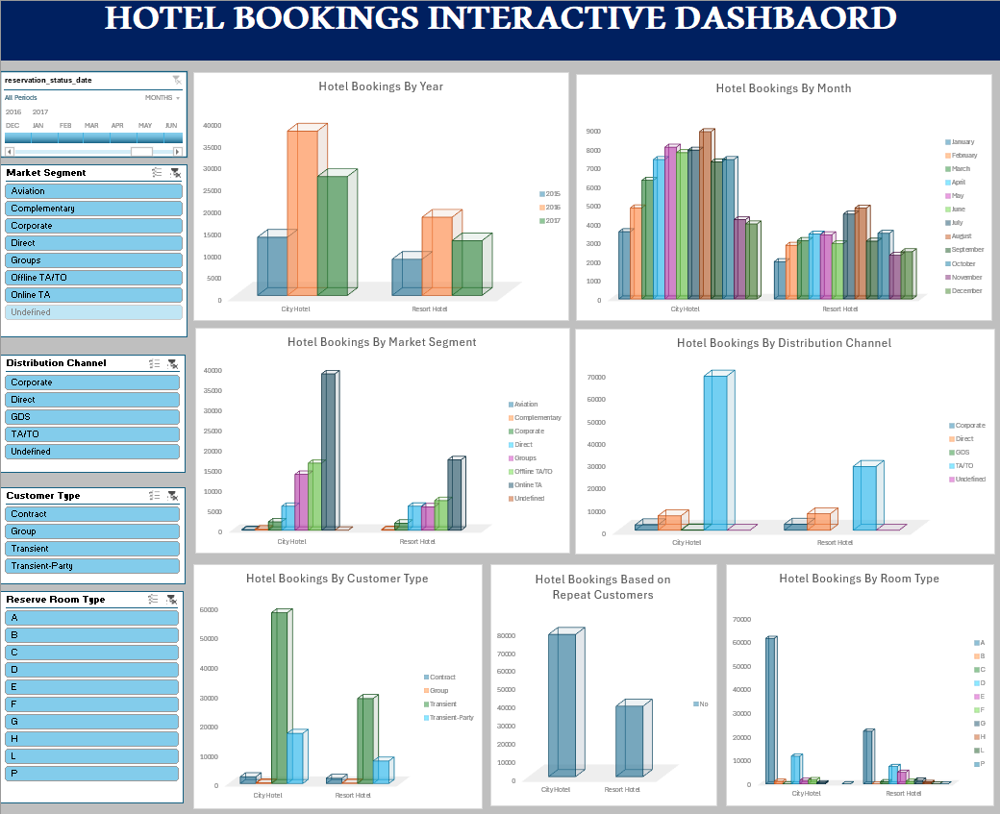
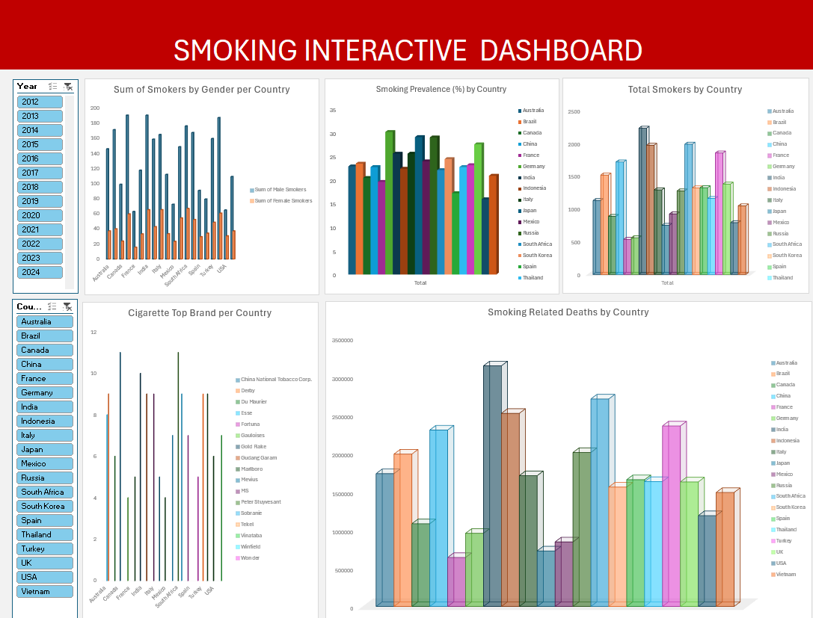

# Project 1

**Title:** [MTN Nigeria Customer Churn Analysis Dashboard (Q1 2025)](https://github.com/MayokunAmao/.github.io/blob/main/Mtncustomerchurn.pbix)

**Tools Used:** Microsoft Power BI (Data Modelling, DAX, Interactive Visuals, Slicers)

**Project Description:** This project analysed customer churn data for MTN Nigeria to uncover patterns, causes, and opportunities for customer retention in Q1 2025. An interactive dashboard was developed to provide stakeholders with a detailed view of churn behaviour, helping to design effective customer retention strategies and optimize revenue.

The dashboard includes the following features:

•	Total Revenue and Revenue Lost: Display of total revenue generated and revenue lost due to churn.

•	Customer Churn and Retention Metrics: Breakdown of total customers, churned customers, and retained customers.

•	Churn Reasons Analysis: Visualization of top reasons for customer churn.

•	Churn Rate by Subscription Plan: Analysis of churn rate across different subscription plans.

•	Churn by Age Group: Insights into churn trends across various customer age demographics.

•	Churned Customers’ Tenure: Distribution of customer lifespan before churn (in months).

•	Churned Customers by State: Geographic distribution of churned customers across Nigerian states.

•	Average Data Usage Analysis: Comparison of data usage between churned and retained customers.

•	Churn by Gender: Gender-based churn statistics.

Interactive Filters Include:

•	Gender

•	Device Type

•	Age Group

•	State

**Key Findings:**

•	Top Churn Drivers: High data costs and better offers elsewhere were the leading causes of customer churn.

•	Age Group Impact: Customers aged 56+ accounted for the highest proportion of churn at 36.62%.

•	Churn by Subscription Plan: Higher churn rates were observed in plans offering larger data bundles (e.g., 200GB, 3.2GB).

•	Tenure Insights: Many customers churned within short tenure periods, highlighting issues with early-stage customer retention.

•	Regional Insights: Abuja, Imo, and Kebbi recorded the highest churn volumes.

•	Gender Impact: Churn was slightly higher among females (52.8%) compared to males (47.2%).

**Dashboard Overview:**

This dashboard empowers MTN Nigeria’s management with actionable insights into customer churn dynamics, enabling them to refine pricing strategies, improve customer onboarding experiences, develop loyalty programs, and target at-risk customer segments more effectively.

#  Project 2

**Title:** [Global Tuberculosis Trends and Health Indicators Dashboard](https://github.com/MayokunAmao/.github.io/blob/main/Tuberculosis.pbix)

**Tools Used:** Microsoft Excel (Data Preparation), Power BI (DAX Measures, Interactive Visualizations, Slicers)

**Project Description:**

This project analyzed global tuberculosis (TB) data across countries, regions, and income levels to uncover health performance patterns and disease trends over time. An interactive Power BI dashboard was developed to provide public health stakeholders with a clear overview of TB-related cases, deaths, incidence rates, treatment success rates, and other key health indicators.

The dashboard empowers decision-makers with real-time insights to support strategic healthcare interventions and policy planning.

The dashboard includes the following features:

•	Total TB Cases and Deaths Overview: KPI cards summarizing the global burden of tuberculosis, enabling a quick assessment of key metrics.

•	TB Incidence, Mortality, and Treatment Success Trends: Line charts showing how TB cases, deaths, incidence rates, and treatment success rates have evolved year over year.

•	Top 10 Countries by TB Deaths and Drug-Resistant TB Cases: Bar charts highlighting countries with the highest TB impact, assisting in identifying priority intervention areas.

•	Health Factors vs Mortality Rate: A scatter plot analyzing the relationship between health expenditure per capita and TB mortality rates, offering insights into the influence of healthcare investment.

Interactive filters include:

•	Region

•	Income Level

•	Country

•	Year

**Key Findings:**

•	Regional Disparities: Certain regions, especially lower-income areas, consistently exhibited higher TB incidence and mortality rates. 

• Treatment Success Insights: A clear relationship was observed between higher access to healthcare services and better treatment success rates. 

• Health System Correlation: Higher national health expenditure per capita was generally associated with lower TB mortality, underscoring the importance of robust healthcare systems. 

• Emergence of Drug-Resistant TB: Some countries showed a growing number of drug-resistant TB cases, highlighting critical areas needing intensified focus.

**Dashboard Overview:**

The dashboard delivers comprehensive and actionable insights into the global fight against tuberculosis. It equips healthcare leaders, researchers, and policymakers with the information needed to monitor TB trends, allocate resources efficiently, and support evidence-based policy and healthcare planning.

# Project 3

**Title:** [Cholera Outbreak Dashboard — Katarina Parish, 1853](https://github.com/MayokunAmao/.github.io/blob/main/cholera.pbix)

**Tools Used:** Microsoft Excel (Data Preparation), Power BI (DAX Measures, Interactive Visualizations, Slicers)

**Project Description:**

This project analyzed historical cholera mortality data from the 1853 outbreak in Katarina Parish (Stockholm), uncovering key patterns in demographics and death trends over time. An interactive Power BI dashboard was developed to provide historians, researchers, and public health stakeholders with a clear overview of cholera-related deaths by date, gender, and age group. The dashboard empowers users with real-time insights to understand outbreak progression, demographic vulnerabilities, and potential intervention points for future epidemic studies.

The dashboard includes the following features:

• Total Deaths and Average Age Overview: KPI cards summarizing the total cholera-related deaths and average age at death, enabling a quick demographic snapshot.

• Cholera Deaths Over Time: A line chart showing daily death counts, highlighting the timeline and peak periods of the outbreak.

• Gender Distribution of Deaths: A pie chart illustrating the proportion of male and female fatalities during the epidemic.

• Age Group Mortality Analysis: A bar chart categorizing deaths into age groups, helping to identify which age ranges were most affected.

• Peak Deaths Indicator: A KPI card showing the highest daily death toll, emphasizing the outbreak's most critical point.

Interactive filters include:

• Gender

• Death Date

• Age Group

**Key Findings:**

• Outbreak Timeline: The cholera epidemic exhibited a rapid onset, peaking within a short time before declining, consistent with known cholera spread patterns.

• Demographic Vulnerability: Males represented a slightly higher proportion of deaths, while individuals aged 31–50 were among the most affected groups.

• Peak Mortality: The day with the highest number of deaths provided critical insights into the outbreak’s most severe phase.

• Data Limitations: The dataset focuses exclusively on Katarina Parish, suggesting localized insights rather than a citywide or national representation.

**Dashboard Overview:**

The dashboard delivers clear, historical, and demographic insights into the 1853 cholera outbreak at a parish level. It equips researchers, public health historians, and epidemiology students with structured data visualization tools to analyze epidemic behavior, mortality patterns, and potential future risk factors in urban settings.

# Project 4

**Title:** [Hotel Bookings Data Analysis Dashboard](https://github.com/MayokunAmao/.github.io/blob/main/Hotel%20Bookings.xlsx)

**Tools Used:** Microsoft Excel (Pivot Tables, Pivot Charts, Slicers, Timelines)

**Project Description:**

This project analyzed hotel bookings data to identify booking patterns across hotel types, distribution channels, customer types, and seasons. The dashboard provides a detailed and interactive way for stakeholders to monitor bookings across time periods, market segments, and customer demographics.

The dashboard includes the following features:

•	Hotel Bookings by Year: Total bookings comparison between City Hotels and Resort Hotels.

•	Hotel Bookings by Month: Seasonal booking trends visualized month-by-month.

•	Hotel Bookings by Market Segment: Insights into bookings made through different customer segments like Corporate, Direct, Online TA, etc.

•	Hotel Bookings by Distribution Channel: Analysis of bookings from various distribution sources.

•	Hotel Bookings by Customer Type: Breakdown of bookings by Contract, Group, Transient, and Transient-Party types.

•	Hotel Bookings Based on Repeat Customers: Analysis of the ratio of repeat vs. new customers.

•	Hotel Bookings by Room Type: Room type preference analysis.

Interactive filters include:

•	Reservation status date

•	Market segment

•	Distribution channel

•	Customer type

•	Reserved room type

**Key Findings:**

•	City Hotels Dominate: City Hotels consistently receive more bookings compared to Resort Hotels.

•	Peak Booking Months: Summer months, especially July and August, show peak booking activity.

•	Online Channels Are Key: Majority of bookings come from Online Travel Agencies and TA/TO channels.

•	Transient Guests: Most guests are first-time transient customers rather than repeat customers.

•	Room Type A Popularity: Room Type A is the most frequently booked across both hotel types.

**Dashboard Overview:**

The dashboard serves as a strategic tool for hotel management teams to identify peak periods, optimize marketing strategies, focus on high-performing customer segments, and enhance guest loyalty efforts.

# Project 5

**Title:** [Global Smoking Analysis Dashboard](https://github.com/MayokunAmao/.github.io/blob/main/Smoking%20Dashboard.xlsx)

**Tools Used:** Microsoft Excel (Pivot Tables, Pivot Charts, Slicers, Timelines)

**Project Description:**

This project involved analyzing global smoking data to understand smoking patterns across different countries, genders, and time periods. The interactive dashboard is designed to provide a comprehensive overview of smoking prevalence, cigarette brand dominance, and smoking-related health impacts worldwide.

The dashboard includes the following features:

•	Sum of Smokers by Gender per Country: Breakdown of male and female smokers across various countries.

•	Smoking Prevalence (%) by Country: Visualization of smoking rates as a percentage of the population.

•	Total Smokers by Country: Aggregated total number of smokers by country.

•	Cigarette Top Brand per Country: Analysis of the most popular cigarette brands dominating each country’s market.

•	Smoking-Related Deaths by Country: Visual representation of deaths attributed to smoking.

Interactive filters include:

•	Year selection

•	Country selection

**Key Findings:**

•	Gender Gap: Males consistently smoke more than females across all countries.

•	High Prevalence Regions: Indonesia, Russia, and Vietnam recorded the highest smoking prevalence rates.

•	Brand Dominance: National brands like China National Tobacco Corp. dominate large markets.

•	Health Impact: Countries with large smoker populations have correspondingly high smoking-related death rates.

•	Stable Global Trends: Although some developed countries show a slight decline, the global number of smokers remains high.

**Dashboard Overview:**

This dashboard provides critical insights into global smoking behavior, helping policymakers and health organizations target interventions, design anti-smoking campaigns, and allocate healthcare resources efficiently.

# Project 6

**Title:** 
Second-Hand Car Dealer Data Analysis Using SQL

**SQL Code:** [Car Data SQL Code](https://github.com/MayokunAmao/.github.io/blob/main/cardata.sql)

**SQL Skills Used:**

o	Data Retrieval (SELECT): Queried and extracted specific car details from the database.

o	Data Aggregation (COUNT, GROUP BY, HAVING): Calculated the number of cars per year, per fuel type, and identified years with high car availability.

o	Data Filtering (WHERE, IN, BETWEEN, AND): Applied conditions to select relevant cars based on year, fuel type, and other attributes.

o	Data Source Specification (FROM): Specified the main car inventory table as the source for all retrievals.

o	Sorting and Ordering (ORDER BY): Organized query outputs for easier analysis and reporting.

**Technology Used:** 

SQL Server

**Project Description:**

This project focuses on the analysis of a comprehensive dataset containing detailed information about a large inventory of second-hand cars. The primary objective is to utilize SQL to extract meaningful insights related to car availability by year, fuel type distribution, sales trends, and overall inventory size.

**Database Design and Implementation:**

o	The dataset was structured into a relational database table (cars) containing attributes such as car name, year, selling price, kilometres driven, fuel type, seller type, transmission, ownership, mileage, engine capacity, max power, torque, and number of seats. Proper normalization and consistent data types were maintained to support efficient querying.

**Data Analysis Using SQL:**

Executed a series of SQL queries to answer specific business questions, including:

o	Total number of cars in the database.

o	Number of cars available each year (especially 2020, 2021, 2022, and 2023).

o	Breakdown of cars by fuel type (Petrol, Diesel, CNG) across years.

o	Identification of years where inventory exceeded 100 cars.

o	Detailed listings of cars available between 2015 and 2023.

**Insight Extraction:**

o	Determined peak years of car availability.

o	Analyzed the popularity and trends of fuel types across different years.

o	Identified gaps in inventory, helping the dealership optimize stock and marketing strategies.

o	Highlighted specific market segments (such as Diesel cars in 2020) for targeted sales.

**Reporting and Visualization:**

o	The structured SQL outputs form the foundation for creating comprehensive reports.

o	These insights can further be used to build dashboards using tools like Power BI or Tableau to visualize trends such as:

o	Year-over-year inventory changes

o	Fuel type demand trends

o	Sales strategy planning based on inventory composition.

By the end of this project, the dealership benefits from a fully functional and queryable SQL database capable of supporting strategic decisions through efficient data analysis and insight generation.

# Project 7

**Title:**

Pizza Sales Data Analysis Using SQL

**SQL Code:**

[Pizza Sales SQL Code](https://github.com/MayokunAmao/.github.io/blob/main/pizza.sql)

*SQL Skills Used:*

o	Data Retrieval (SELECT): Queried and extracted specific pizza sales details from the database.

o	Data Aggregation (SUM, COUNT, GROUP BY, HAVING): Calculated total revenue, total pizzas sold, and order counts.

o	Data Filtering (WHERE, IN, BETWEEN, AND): Applied filters to select pizzas based on date ranges, categories, size, and price points.

o	Data Source Specification (FROM): Specified the pizza sales table as the main data source for analysis.

o	Sorting and Ordering (ORDER BY): Organized query outputs to enable better analysis and interpretation of sales data.

**Technology Used:**

SQL Server

**Project Description:**

This project involves the analysis of a real-world pizza sales dataset containing transaction-level details for a pizzeria. The main objective is to use SQL queries to uncover business insights related to total revenue generation, pizza sales volumes, customer ordering patterns, and product popularity based on size, type, and price.

**Database Design and Implementation:**

o	The dataset was organized into a relational database table (pizza_sales) containing attributes such as order ID, order date, pizza name, pizza size, pizza category, quantity sold, unit price, and total price.

o	Data was cleaned and structured to ensure consistent formatting (e.g., proper date handling, uniform size categories) for optimal querying and analysis performance.

Data Analysis Using SQL:

Executed a series of SQL queries to answer key business questions, including:

o	Total revenue generated over the sales period.

o	Total quantity of pizzas sold.

o	Total number of distinct customer orders.

o	Total sales for vegetarian pizzas.

o	Number of specific popular pizzas (The Hawaiian Pizza and The Greek Pizza) sold.

o	Pizzas ordered in specific months like January 2015 and November 2015.

o	Quantity sold of specialty pizzas such as The Spinach Supreme Pizza.

o	List of all medium-sized pizzas sold.

o	Identification of pizzas priced above $12.50.

**Insight Extraction:**

o	Determined the overall performance of pizza sales and revenue contribution.

o	Identified the popularity of vegetarian and non-vegetarian categories among customers.

o	Recognized peak months for specific pizza sales trends.

o	Highlighted premium pizzas based on pricing strategy (> $12.50), allowing for targeted marketing and upselling.

o	Gained insights into customer preferences regarding pizza size, especially medium-sized pizzas.

**Reporting and Visualization:**

o	The structured SQL outputs are ideal for creating comprehensive dashboards and visual reports.

o	Potential visualizations include:

o	Monthly revenue trends

o	Top-selling pizza categories and types

o	Size-based sales performance

o	Price sensitivity and premium product analysis

These insights support operational and strategic decision-making for the pizzeria, enabling better inventory management, promotional planning, and targeted customer engagement strategies.

# Project 8

 **📚 Title:** 
 
 QS World University Rankings 2025 Data Analysis Using SQL

**SQL Code:**

[2025 QS University Rankings](https://github.com/MayokunAmao/.github.io/blob/main/QESUniRankings2025.sql)

**SQL Skills Used:**

o Data Retrieval (SELECT): Extracted information about universities’ overall rankings, academic reputation, sustainability, and employment outcomes from the dataset.

o Data Aggregation (AVG, COUNT, GROUP BY): Calculated average academic reputation scores and sustainability scores, as well as counted universities by country and region.

o Data Filtering (WHERE, IS NOT NULL, AND): Applied conditions to select universities with meaningful rank changes, strong international faculty presence, and top employment outcomes.

o Data Source Specification (FROM): Defined the data source as [dbo].[2025 QS_University_Rankings] from the SQL Server database.

o Sorting and Ordering (ORDER BY): Organized query outputs, such as sorting universities by Overall Score, Faculty Student Score, and University Counts, in descending order for analysis clarity.

o Limiting Results (TOP): Used TOP(n) syntax to retrieve the most relevant subsets, such as top universities or top-ranked regions.

**Technology Used:**

SQL Server 

**Project Description:**

This project centers around performing a deep analysis of the QS World University Rankings 2025 dataset. The focus was on using SQL queries to uncover patterns related to academic reputation, research intensity, graduate employability, and sustainability efforts among over 1,500 institutions globally. The insights were meant to assist education consultants, students, universities, and policymakers in:

o Benchmarking university performance.

o Identifying leading institutions across various global metrics.

o Recognizing excellence in academic and sustainability dimensions.

**Database Design and Implementation:**

o Database Table: [dbo].[2025 QS_University_Rankings]

o Columns Included: Institution Name, Location, Region, RANK_2024, RANK_2025, Academic Reputation Score, Faculty Student Score, International Faculty Score, Employment Outcomes Score, Sustainability Score, and others.

**Data Cleaning Implementations:**

o Ensured ranking columns (2024/2025) were properly numeric and free from equality signs ('=').

o Treated missing or null values logically (e.g., using IS NOT NULL filters).

o Standardized text-based columns like Region and Research Intensity for consistent querying.

**Data Analysis Using SQL:**

o Executed a series of SQL queries to answer the following business questions:

o Top 10 Universities by Overall Score (2025): Selected and ordered the highest-scoring universities globally.

o Universities with the Biggest Rank Improvements: Identified universities with the most significant positive movement from 2024 to 2025.

o Average Academic Reputation by Region: Provided regional benchmarking on perceived academic quality.

o Top 5 Countries by Number of Ranked Universities: Highlighted the countries contributing most heavily to the global education market.

o Top 3 Regions with Most Universities Ranked: Aggregated university counts by region to see educational density globally.

o Universities with Very High Research Intensity and Top 100 Ranks: Focused on elite institutions with outstanding research commitments.

o Universities with International Faculty Score > 90: Filtered globally diversified faculties in higher education.

o Universities with Employment Outcomes Score > 90: Showed universities with highly employable graduates.

o Average Sustainability Score for Europe: Assessed how European institutions perform regarding sustainable practices.

o Top 10 Universities by Faculty Student Score: Recognized institutions providing the most attention per student.

**Insight Extraction:**

o Identified elite performers across key metrics like research, sustainability, and employability.

o Detected leading countries and regions contributing to global higher education.

o Showed student-centric universities via strong Faculty-to-Student ratios.

o Highlighted internationalized universities by their faculty composition.

o Recognized top employment-focused institutions helping graduates transition into the workforce.

o Surfaced sustainability champions among European universities.

**Reporting and Visualization:**

o The SQL query outputs are ideal for dynamic dashboard visualizations, potentially using Power BI or Tableau, including:

o Global Map Visualization: Distribution of universities worldwide.

o Ranking Trend Lines: Movements in institutional performance year-over-year.

o Bar Charts: Top 10 universities by Overall Score, Faculty Student Score, and Employment Outcomes.

o Pie Charts: Public vs Private university shares.

o Scatter Plots: International Faculty diversity vs Academic Reputation.

These visualizations can guide students, administrators, and policymakers in strategic decision-making about education systems.
